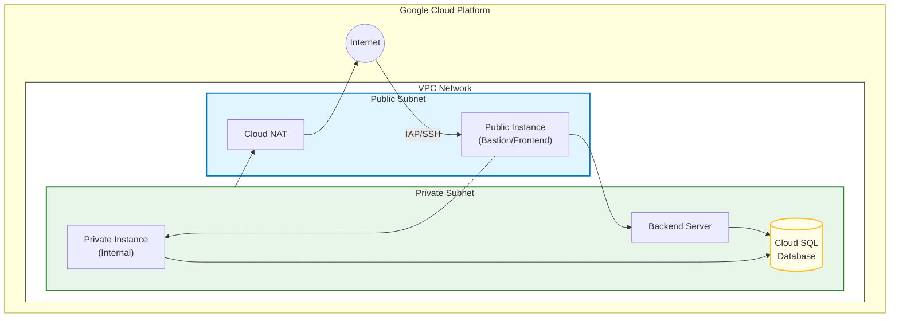
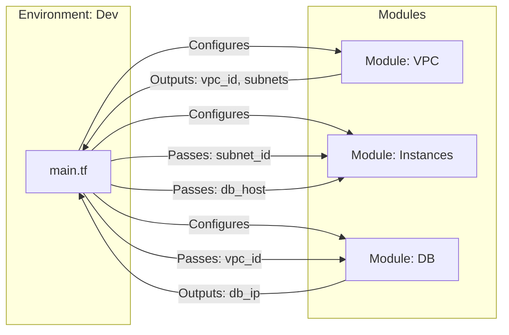

# Titan Infrastructure Suite

## Overview

Welcome to the **Titan Infrastructure Suite**. This project provides a robust, modular Infrastructure-as-Code (IaC) foundation for managing cloud resources on **Google Cloud Platform (GCP)** using [Terraform](https://www.terraform.io/).

It is designed to support multiple environments (Development and Production) with a focus on scalability, maintainability, and security.

## System Architecture

### Infrastructure Overview



### Module Dependencies



## Architecture

The project follows a standard modular directory structure:

### Environments

Layered configurations for isolated deployments.

- **`environments/dev`**: Development environment for testing and iteration.
- **`environments/prod`**: Production environment for stable, live workloads.

### Modules

Reusable components that encapsulate infrastructure logic.

- **`modules/vpc`**: Networking foundation (Virtual Private Cloud, Subnets, Firewalls).
- **`modules/instances`**: Compute resources and virtual machines.
- **`modules/db`**: Database provisioning and management.

## Prerequisites

- [Terraform](https://www.terraform.io/downloads.html) >= 1.0.0
- [Google Cloud SDK](https://cloud.google.com/sdk/docs/install) configured with appropriate credentials.

## Getting Started

1. **Initialize Terraform**
   Navigate to the desired environment directory:

   ```bash
   cd environments/dev
   terraform init
   ```

2. **Plan Deployment**
   Review proposed changes:

   ```bash
   terraform plan
   ```

3. **Apply Configuration**
   Provision resources:
   ```bash
   terraform apply
   ```

## Best Practices

- **State Management**: Terraform state files (`*.tfstate`) are ignored to prevent sensitive data leakage. Use a remote backend (e.g., GCS) for team collaboration.
- **Variable Management**: Avoid committing `terraform.tfvars`. Use environment variables or a secure secret manager for sensitive inputs.

---

_Generated for the Terraform Learning Project._
